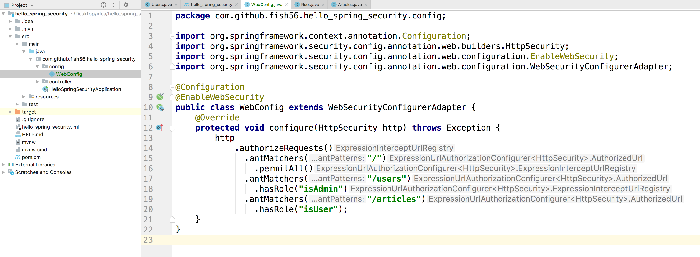
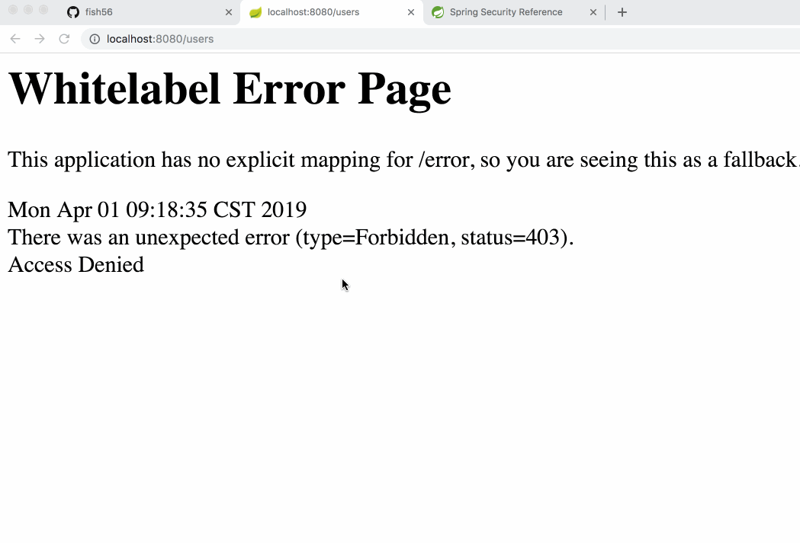

其实很简单

1. 创建一个配置类，它需要：
   - 用`@Configuration` `@EnableWebSecurity`标注
   - 继承自`WebSecurityConfigurerAdapter`类
2. 重写`void configure(HttpSecurity http) throws Exception`方法



``` java
@Configuration
@EnableWebSecurity
public class Config extends WebSecurityConfigurerAdapter {

    @Override
    protected void configure(HttpSecurity http) throws Exception {
        http
            .authorizeRequests()
                .antMatchers("/")
                  .permitAll()
                .antMatchers("/users")
                  .hasRole("isAdmin")
                .antMatchers("/articles")
                  .hasRole("isUser")
    }
}
```


我来解释下上面的代码

- 使用了。。设计模式，
- 在内存中创建了几个用户，
- 密码前面加上noop，表示
- 给路由添加了权限管理


然后我们来访问一下，我们发现我们已经可以访问首页了，但是依然不能访问users目录




好，我们已经初步完成权限分级了。