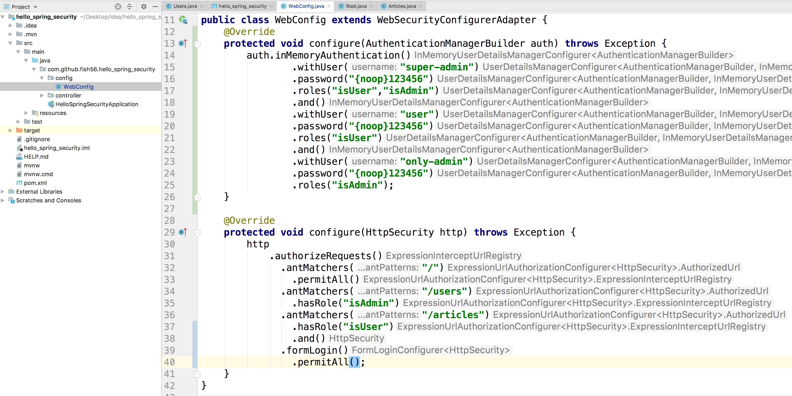
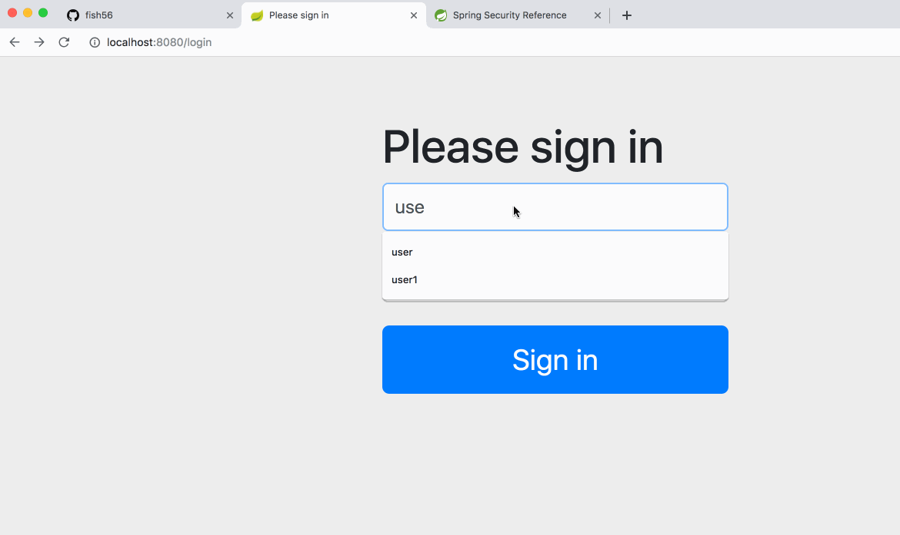

接下来我们来实现登录功能

1. 注册用户，为了方便起见我们首先用硬编码的方式，直接在内存中建立几个用户

2. 运行用户登录，开发formLogin + permitAll，Security 默认会让你在这个路由登录，现在

   我们直接使用现成的，后续我们自己写

   

``` java
@Configuration
@EnableWebSecurity
public class WebConfig extends WebSecurityConfigurerAdapter {
    @Override
    protected void configure(AuthenticationManagerBuilder auth) throws Exception {
        auth.inMemoryAuthentication()
              .withUser("super-admin")
                .password("{noop}123456")
                .roles("isUser","isAdmin")
                .and()
              .withUser("user")
                .password("{noop}123456")
                .roles("isUser")
                .and()
              .withUser("only-admin")
                .password("{noop}123456")
                .roles("isAdmin");
    }

    @Override
    protected void configure(HttpSecurity http) throws Exception {
        http
            .authorizeRequests()
              .antMatchers("/")
                .permitAll()
              .antMatchers("/users")
                .hasRole("isAdmin")
              .antMatchers("/articles")
                .hasRole("isUser")
                .and()
              .formLogin()
                .permitAll();
    }
}
```





我们发现我么也实现了权限管理，

使用user登录的不能访问，users list

而使用 only-admin的，却可以


git add inmerey user