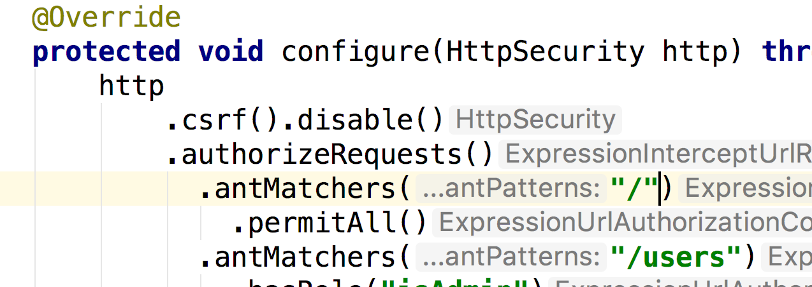
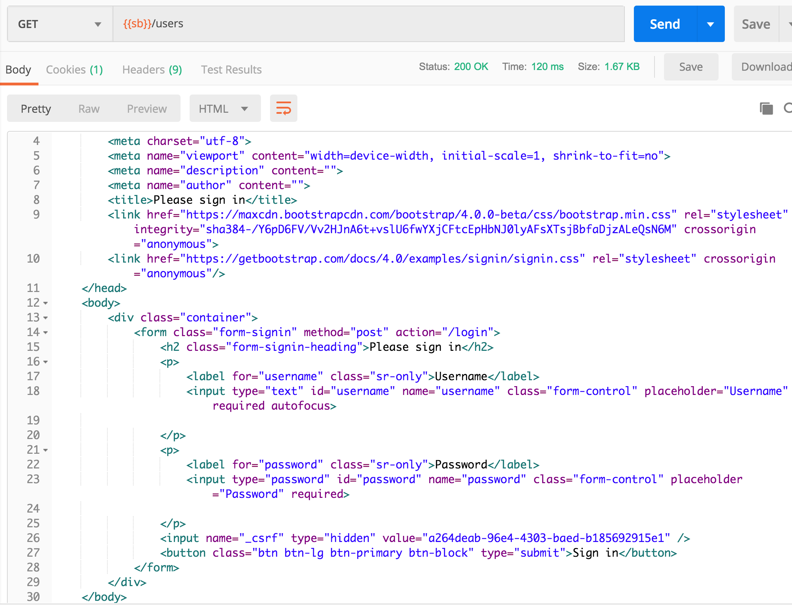
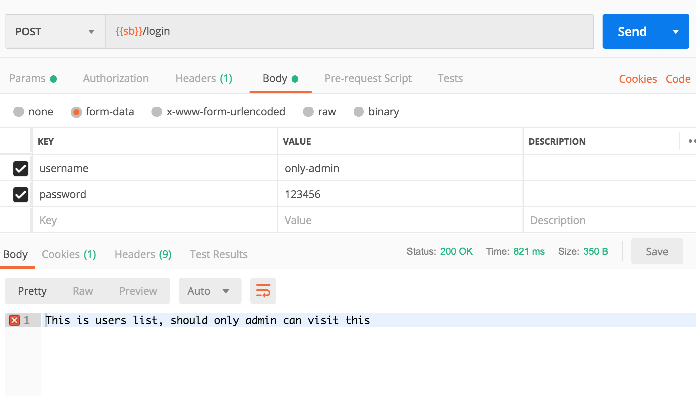
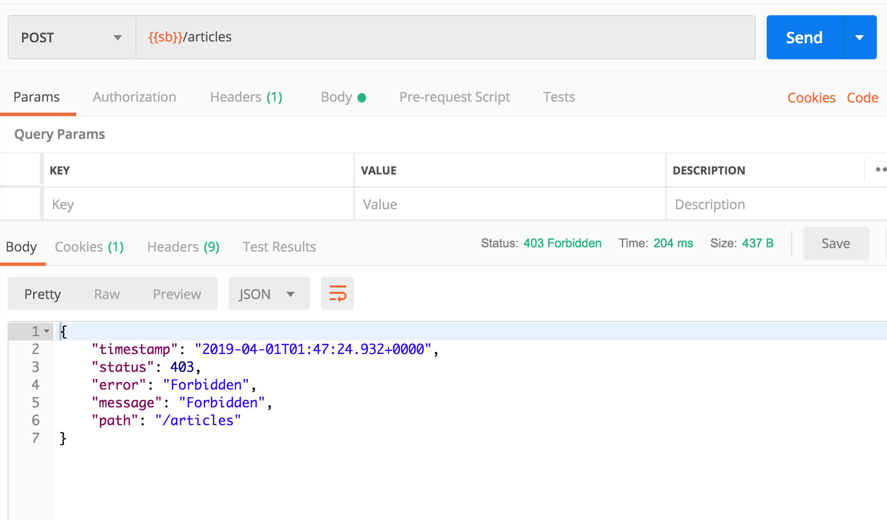
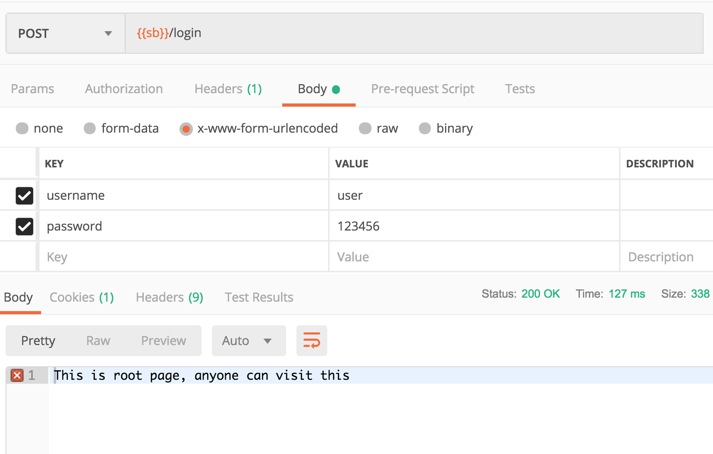
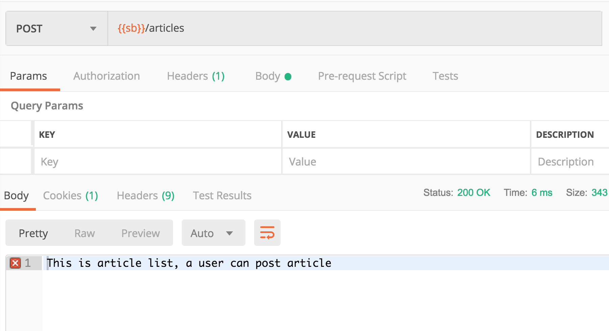
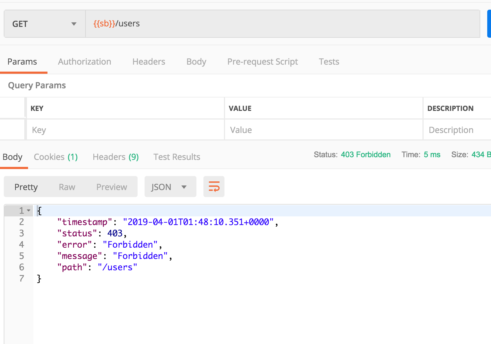

不过之前的在浏览器演示的太过于黑箱，接下来我们使用postman来演示

1. 记得csrf，具体自行百度

添加这样的代码就行了

然后我们在postman中访问/users

我们发现访问失败，返回了一个登录页面，这个登录页面就是我们之前看到的页面，之前我们输入登录的时候，实际上是想/login 发起了一个post请求，接下来我们模仿这个动作，手动的在postman中登录

可以看到，登录成功了，因为我们没有在代码中定义登录完成后的动作，所以spring Security直接返回了我们之前尝试访问的页面

然后这个onlyAdmin依旧无法访问 articles

然后我们切换用户

可以，基本完成需求，下一步我们需要在数据中存储用户信息，同时提供注册的接口。