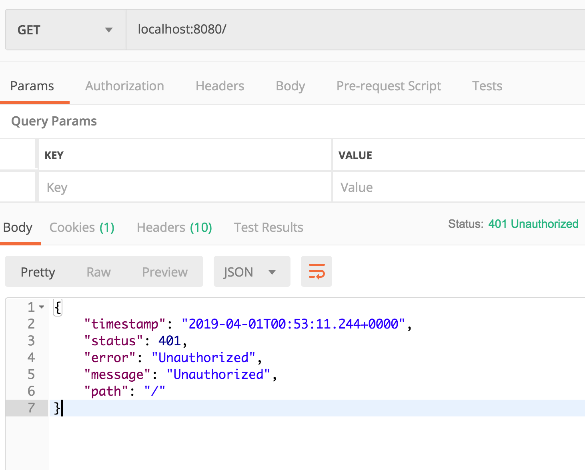

首先，写一个最简单的Spring Boot Web程序，我们有以下路由

```java
@RestController
@RequestMapping("/")
public class Root {
    @GetMapping
    public String root(){
        return "This is root page, anyone can visit this";
    }
}

--------------

@RestController
@RequestMapping("/articles")
public class Articles {
    @PostMapping
    public String article(){
        return "This is article list, a user can post article";
    }
}

--------------

@RestController
@RequestMapping("/users")
public class Users {
    @GetMapping
    public String users(){
        return "This is users list, should only admin can visit this";
    }
}
```

大家可以前往init，目前这些API是对所有人开发的。但是我们希望加入权限管理


1. GET /

   这是我们的首页，应该允许所有人访问

2. POST /articles

   发表文章，只允许登录用户

3. GET /users

   只允许管理员访问

然后我们希望有以下账号

- 普通用户，可以提交文章，不能获得用户列表
- 普通管理员，可以看到用户列表，但是不允许发表文章
- 超级管理员，可以发表文章，也可以看到用户列表


在开始，没有权限管理，所有人都可以访问，接下我们可以看到，不修改一行原始的业务代码。Spring Security就可以帮我们做好访问控制。


然后大家引入入这个包就行了，

```xml
<dependency>
    <groupId>org.springframework.boot</groupId>
    <artifactId>spring-boot-starter-security</artifactId>
</dependency>
```


Spring Boot会自动装配，现在你所有的URL都被保护了



git add security...