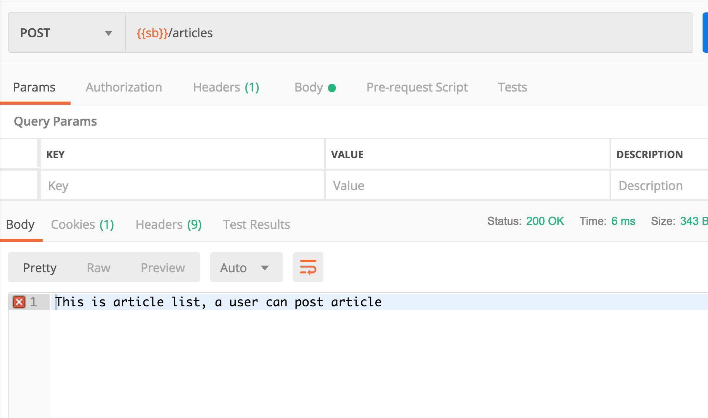

## 用户的注册于登录

之前是在代码中因编码到内存中，肯定是不行的，

接下来我们开自定义配置


关键就是我么重写方法的时候，不在使用inMerey 了，而是使用

Auth.userDetatilService,中间传入一个实现user接口的类。


每次需要认证的时候，就会调用这个方法，更加这个方法的返回值来确认是否等合法

1. 创建一个实现 的类
2. 通过@Autowired自动装配到配置类
3. 传给auth
4. 注意要修改hasRole 修改为hasAuthorze,它们的区别以后再说

``` java
@Service
public class MyUserDetailsService implements UserDetailsService  {

    @Override
    public UserDetails loadUserByUsername(String username)
            throws UsernameNotFoundException {
        List<SimpleGrantedAuthority> simpleGrantedAuthorities = new ArrayList<>();
        simpleGrantedAuthorities.add(new SimpleGrantedAuthority("isUser"));
        return new User(username, "{noop}123456", simpleGrantedAuthorities);
    }
}
```


```java
@Configuration
@EnableWebSecurity
public class Config extends WebSecurityConfigurerAdapter {

    @Autowired
    private MyUserDetailsService myUserDetailsService;
    
    @Override
    protected void configure(AuthenticationManagerBuilder auth) throws Exception {
        auth.userDetailsService(myUserDetailsService);
    }

    @Override
    protected void configure(HttpSecurity http) throws Exception {
        http
            .csrf().disable()
            .authorizeRequests()
                .antMatchers("/")
                  .permitAll()
                .antMatchers("/users")
                  .hasAuthority("isAdmin")
                .antMatchers("/articles")
                  .hasAuthority("isUser")
                .and()
                .formLogin()
                  .permitAll();
    }
}

```


然后我么重启程序，测试一下是否可以登录




我们确实达到了预期的效果。


当然，我们上面的设置没有提供具体的校验，下面我们来