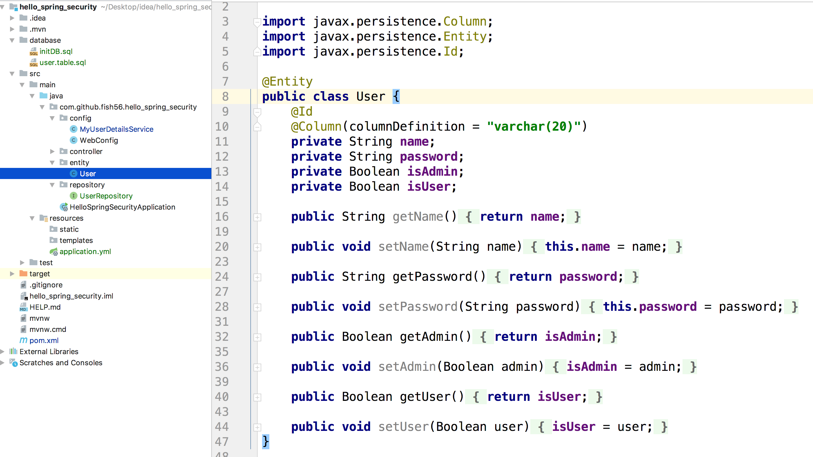
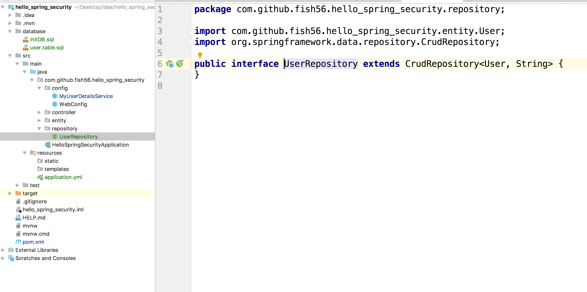
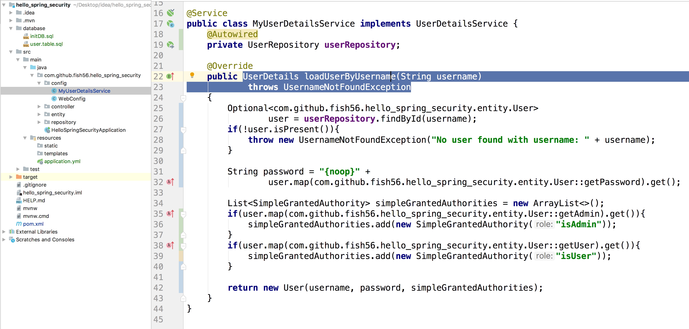
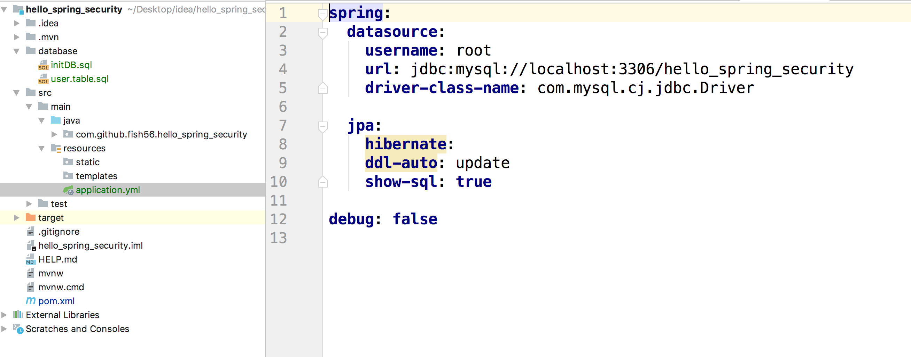
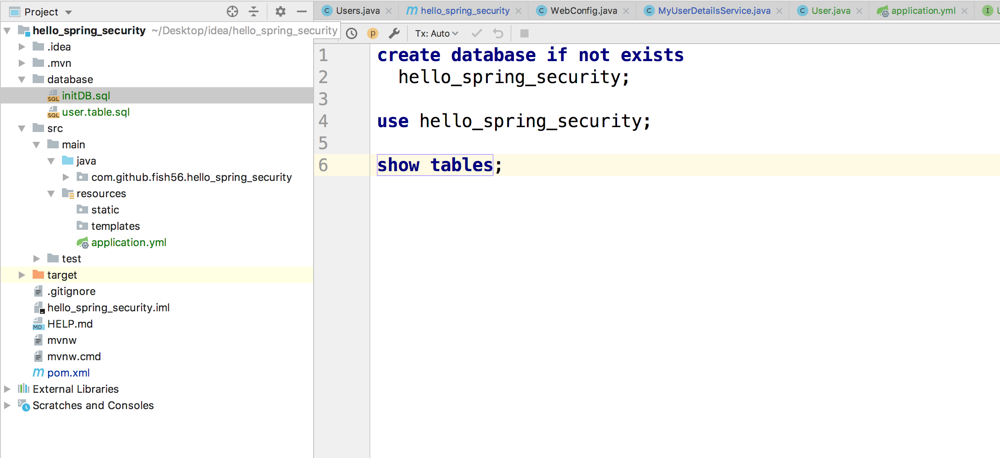
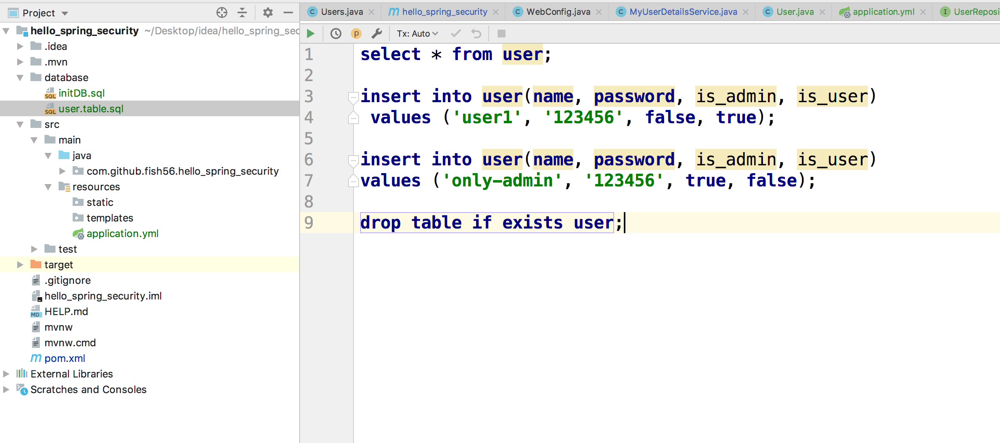
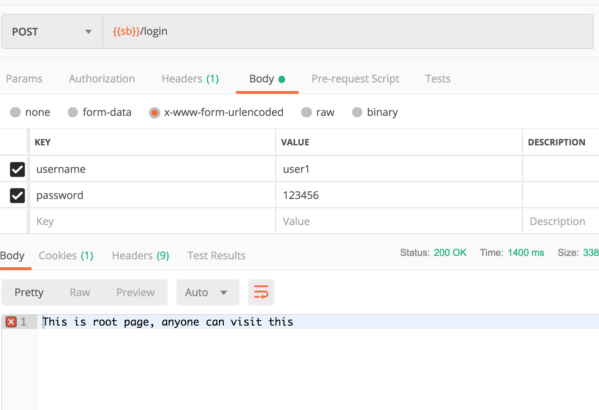
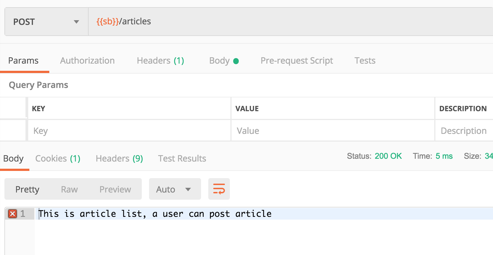
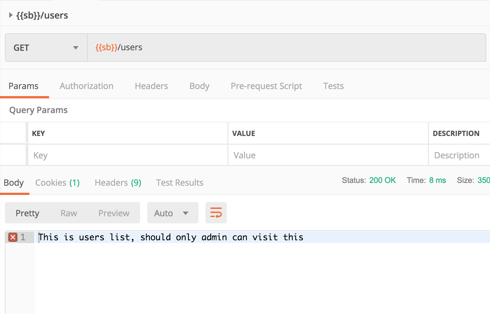

1. 通过JPA访问数据库，要求有这反面的基础
2. 提供注册功能。

就想我们之前写的，我们在`UserDetails loadUserByUsername(String username)        **throws** UsernameNotFoundException`中，只需要访问数据库，动态的确认用户是否存在以及相应的权限就信了。

所以操作很见到，不过到用到JPA，下面的步骤很多，不过都是JPA相关的内容，核心就是上面的一点。

1. 创建实体

